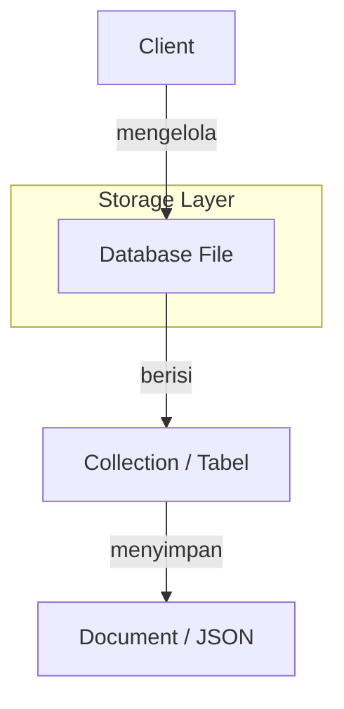

# 📚 Dokumentasi Lengkap BangronDB

[](https://github.com/herdianrony/BangronDB/releases)

## 📖 Daftar Isi

1. [Overview](#overview)
2. [Instalasi](#instalasi)
3. [Konsep Dasar](#konsep-dasar)
4. [Client & Database](#client--database)
5. [Collection](#collection)
6. [Schema Validation](#schema-validation)
7. [Soft Deletes](#soft-deletes)
8. [Operasi CRUD](#operasi-crud)
9. [Query & Filtering](#query--filtering)
10. [Encryption & Security](#encryption--security)
11. [Searchable Fields](#searchable-fields)
12. [Hooks & Events](#hooks--events)
13. [Populate & Relationships](#populate--relationships)
14. [Indexing](#indexing)
15. [Health & Monitoring](#health--monitoring)
16. [Change Notification](#change-notification)
17. [Dynamic Configuration](#dynamic-configuration)
18. [Utilities](#utilities)
19. [Examples](#examples)
20. [Enterprise Readiness](#enterprise-readiness)
21. [Performa & Benchmark](#performa--benchmark)

## 📋 Overview

BangronDB adalah database NoSQL berbasis SQLite dengan API mirip MongoDB, yang dibangun untuk PHP. Mendukung enkripsi, hook, relasi, dan fitur enterprise lainnya.

### Fitur Utama:

- **API MongoDB-like** - Sintaks familiar seperti MongoDB
- **Enkripsi AES-256** - Enkripsi tingkat kolom dan koleksi
- **Searchable Fields** - Pencarian pada data terenkripsi
- **Hooks System** - Event-driven hooks untuk semua operasi
- **Relationships** - Populate untuk relasi antar koleksi
- **Multiple ID Modes** - UUID, manual, dan prefiks
- **Health Monitoring** - Monitoring dan metrics database
- **SQLite Backend** - Performa tinggi dengan ACID compliance

## 🚀 Instalasi

### Persyaratan

- PHP 8.0+ dengan ekstensi PDO SQLite
- Ekstensi OpenSSL untuk enkripsi
- Composer (Direkomendasikan)

### Instalasi via Composer

```bash
composer require herdianrony/BangronDB
```

### Instalasi Manual

Jika tidak menggunakan Composer, include file secara manual:

```php
<?php
// Sertakan semua file yang diperlukan
require_once __DIR__ . '/src/Client.php';
require_once __DIR__ . '/src/Database.php';
require_once __DIR__ . '/src/Collection.php';
require_once __DIR__ . '/src/Cursor.php';
require_once __DIR__ . '/src/UtilArrayQuery.php';

// Sertakan traits
require_once __DIR__ . '/src/Traits/EncryptionTrait.php';
require_once __DIR__ . '/src/Traits/HooksTrait.php';
require_once __DIR__ . '/src/Traits/IdGeneratorTrait.php';
require_once __DIR__ . '/src/Traits/QueryBuilderTrait.php';
require_once __DIR__ . '/src/Traits/SchemaValidationTrait.php';
require_once __DIR__ . '/src/Traits/SearchableFieldsTrait.php';
require_once __DIR__ . '/src/Traits/SoftDeleteTrait.php';

// Sekarang Anda dapat menggunakan BangronDB
use BangronDB\Client;
```

### Struktur Namespace

```php
use BangronDB\Client;
use BangronDB\Database;
use BangronDB\Collection;
use BangronDB\Cursor;
```

## ⚡ Quick Start (5 Menit)

```php
use BangronDB\Client;

// 1. Inisialisasi (Data disimpan di folder 'data')
$client = new Client(__DIR__ . '/data');

// 2. Pilih database & collection
$users = $client->app->users;

// 3. Simpan data (Otomatis buat ID)
$userId = $users->insert([
    'name' => 'John Doe',
    'role' => 'admin'
]);

// 4. Cari data
$user = $users->findOne(['name' => 'John Doe']);
echo "Halo, " . $user['name'];
```

## 🏗️ Konsep Dasar

BangronDB menyimpan data dalam format **JSON** (seperti file teks yang terstruktur) di dalam database **SQLite**. Ini memberikan fleksibilitas NoSQL dengan ketangguhan database relasional.

### Arsitektur



### Hierarki Data

- **Client**: Manager utama yang mengatur koneksi ke berbagai database.
- **Database**: Satu file fisik `.bangron` di komputer Anda.
- **Collection**: "Folder" di dalam database untuk mengelompokkan data sejenis (misal: users, products).
- **Document**: Satu record data dalam format array/JSON.

## 🔌 Client & Database

### Inisialisasi Client

```php
use BangronDB\Client;

// Database file-based
$client = new Client(__DIR__ . '/data');

// Database in-memory
$client = new Client(':memory:');

// Dengan options
$options = [
    'encryption_key' => 'my-secret-key',
    'timeout' => 30
];
$client = new Client(__DIR__ . '/data', $options);
```

### Mengakses Database

```php
// Method chaining
$db = $client->selectDB('mydatabase');
$collection = $db->selectCollection('users');

// Magic getter
$db = $client->mydatabase;
$collection = $db->users;

// Langsung ke collection
$collection = $client->selectCollection('mydatabase', 'users');
```

### Operasi Database

```php
// List databases
$databases = $client->listDBs(); // ['db1', 'db2']


// Health metrics
$metrics = $db->getHealthMetrics();
$report = $db->getHealthReport();

// Cleanup
$client->close();
Database::closeAll();
```

## 📦 Collection

### Inisialisasi Collection

```php
$collection = $db->selectCollection('users');
// atau
$collection = $db->users;
```

### Konfigurasi Collection

```php
// Set ID generation mode
$collection->setIdModeAuto();        // UUID v4 (default)
$collection->setIdModeManual();      // Manual ID
$collection->setIdModePrefix('USR'); // Prefiks: USR-000001

// Enkripsi per koleksi
$collection->setEncryptionKey('collection-secret-key');

// Searchable fields
$collection->setSearchableFields(['email', 'phone'], true); // true untuk hashing

// Drop collection
$collection->drop();

// Rename collection
$success = $collection->renameCollection('new_name'); // Returns true/false
```

### ID Generation Modes

```php
// Auto (UUID v4) - default
// Contoh: "550e8400-e29b-41d4-a716-446655440000"

// Manual - harus menyediakan _id manual
$collection->setIdModeManual();

// Prefix - auto increment dengan prefiks
$collection->setIdModePrefix('USR');
// Contoh: "USR-000001", "USR-000002"
```

## 📝 Operasi CRUD

### Create (Insert)

```php
// Insert single document
$id = $collection->insert([
    'name' => 'John Doe',
    'email' => 'john@example.com',
    'age' => 30
]);

// Insert multiple documents (batch insert)
$count = $collection->insert([
    ['name' => 'Alice', 'age' => 25],
    ['name' => 'Bob', 'age' => 35]
]); // Returns number of inserted documents

// Insert dengan ID manual (mode manual)
$collection->setIdModeManual();
$id = $collection->insert([
    '_id' => 'custom-id-123',
    'name' => 'Custom User'
]);
```

### Read (Find)

```php
// Find all documents
$cursor = $collection->find();
$users = $cursor->toArray();

// Find one document
$user = $collection->findOne(['name' => 'John']);

// Find dengan criteria
$cursor = $collection->find([
    'age' => ['$gt' => 25],
    'status' => 'active'
]);

// Dengan projection (field selection)
$cursor = $collection->find(
    ['age' => ['$gte' => 21]],
    ['name' => 1, 'email' => 1] // Hanya ambil name dan email
);

// Count documents
$count = $collection->count(['status' => 'active']);
```

### Update

```php
// Update dengan merge (default)
$updated = $collection->update(
    ['name' => 'John Doe'],        // Criteria
    ['age' => 31, 'city' => 'NY'] // Data baru
);
// Hasil: {name: 'John Doe', email: 'john@example.com', age: 31, city: 'NY'}

// Update tanpa merge (replace)
$updated = $collection->update(
    ['name' => 'John Doe'],
    ['age' => 31],
    false // Non-merge mode
);
// Hasil: {_id: '...', age: 31} // field lain hilang

// MongoDB-style Updates dengan $set dan $unset
$collection->update(
    ['name' => 'John Doe'],
    [
        '$set' => ['age' => 31, 'city' => 'NY'],     // Set fields
        '$unset' => ['old_field' => '']              // Remove fields
    ]
);
// Hasil: {name: 'John Doe', email: 'john@example.com', age: 31, city: 'NY'}

// Kombinasi merge dan MongoDB-style
$collection->update(
    ['name' => 'John Doe'],
    [
        'status' => 'active',                        // Merge field
        '$set' => ['last_login' => date('c')],       // Set field
        '$unset' => ['temp_password' => '']          // Remove field
    ]
);

// Upsert dengan save() - Insert jika belum ada, Update jika sudah ada
$collection->save([
    '_id' => 'existing-id',
    'name' => 'Updated Name'
]); // Akan update jika _id sudah ada, atau insert jika belum ada
```

### Delete

```php
// Remove documents
$deleted = $collection->remove(['status' => 'inactive']);

// Remove semua documents
$collection->remove([]);
```

### Pagination & Sorting

```php
$cursor = $collection->find(['status' => 'active'])
    ->skip(10)    // Skip 10 dokumen
    ->limit(5)    // Ambil 5 dokumen
    ->sort(['age' => 1]); // Sort ascending

// Sort descending
$cursor->sort(['age' => -1]);
```

## 🔍 Query & Filtering

### Operators yang Didukung

```php
// Comparison operators
$collection->find(['age' => ['$gt' => 18]]);
$collection->find(['age' => ['$gte' => 21]]);
$collection->find(['age' => ['$lt' => 65]]);
$collection->find(['age' => ['$lte' => 60]]);
$collection->find(['age' => ['$ne' => 30]]);

// Array operators
$collection->find(['role' => ['$in' => ['admin', 'editor']]]);
$collection->find(['role' => ['$nin' => ['guest', 'banned']]]);

// Existence operator
$collection->find(['email' => ['$exists' => true]]);

// Logical operators
$collection->find([
    '$or' => [
        ['age' => ['$lt' => 18]],
        ['age' => ['$gt' => 65]]
    ]
]);

$collection->find([
    '$and' => [
        ['status' => 'active'],
        ['age' => ['$gte' => 21]]
    ]
]);

// Regex matching
$collection->find(['name' => ['$regex' => '^John']]);

// Custom function
$collection->find([
    'custom_field' => [
        '$func' => function($value) {
            return strlen($value) > 5;
        }
    ]
]);

// Fuzzy search
$collection->find([
    'description' => [
        '$fuzzy' => [
            '$search' => 'important document',
            '$minScore' => 0.7,
            '$distance' => 3
        ]
    ]
]);
```

### Dot Notation untuk Nested Fields

```php
// Query nested fields
$collection->find(['address.city' => 'New York']);

// Update nested fields
$collection->update(
    ['_id' => '123'],
    ['address.city' => 'Los Angeles']
);
```

### Custom Query Functions

```php
// PHP callback sebagai criteria
$result = $collection->find(function($document) {
    return $document['age'] > 18 &&
           strpos($document['email'], '@gmail.com') !== false;
});
```

## 🔐 Encryption & Security

### Database-wide Encryption

```php
// Set encryption key di level database
$db = new Database('path/to/db.sqlite', [
    'encryption_key' => 'master-secret-key'
]);
```

### Collection-specific Encryption

```php
// Override encryption key per collection
$collection->setEncryptionKey('collection-specific-key');

// Cek status enkripsi
$isEncrypted = $collection->isEncrypted(); // true/false
```

### Format Data Terenkripsi

```json
{
  "_id": "550e8400-e29b-41d4-a716-446655440000",
  "encrypted_data": "base64-encrypted-string",
  "iv": "base64-initialization-vector"
}
```

### Algorithm Details

- **Algorithm**: AES-256-CBC
- **Key Derivation**: SHA-256 hashing
- **IV**: Random bytes per encryption
- **Storage**: Base64 encoded dalam JSON

## 🔎 Searchable Fields

### Konfigurasi Searchable Fields

```php
// Tambah searchable fields dengan hashing
$collection->setSearchableFields(['email', 'phone'], true);
// Hashed: si_email = sha256(email), si_phone = sha256(phone)

// Tanpa hashing (plain text)
$collection->setSearchableFields(['name', 'city'], false);
// Plain: si_name = "John Doe", si_city = "New York"

// Nested fields support
$collection->setSearchableFields(['address.zip'], false);

// Remove searchable field
$collection->removeSearchableField('email', true); // true untuk drop column
```

### Cara Kerja

1. **Column Naming**: `si_{fieldname}` (si = searchable index)
2. **Hashing**: Opsional SHA-256 untuk privacy
3. **Query Optimization**: Menggunakan column langsung bukan json_extract
4. **Auto-maintenance**: Columns dibuat/dihapus otomatis

### Contoh Query dengan Searchable Fields

```php
// Query akan otomatis menggunakan column si_email jika ada
$users = $collection->find(['email' => 'john@example.com']);

// Untuk hashed fields, value otomatis di-hash
$collection->find(['email' => 'john@example.com']);
// Diterjemahkan ke: WHERE si_email = sha256('john@example.com')
```

## 🎣 Hooks & Events

### Event yang Tersedia

```php
Collection::HOOK_BEFORE_INSERT    // Sebelum insert
Collection::HOOK_AFTER_INSERT     // Setelah insert
Collection::HOOK_BEFORE_UPDATE    // Sebelum update
Collection::HOOK_AFTER_UPDATE     // Setelah update
Collection::HOOK_BEFORE_REMOVE    // Sebelum delete
Collection::HOOK_AFTER_REMOVE     // Setelah delete
```

### Registrasi Hooks

```php
// Before insert hook
$collection->on('beforeInsert', function($document) {
    // Validasi atau modifikasi data
    if (!isset($document['created_at'])) {
        $document['created_at'] = date('Y-m-d H:i:s');
    }
    return $document; // Return modified document
});

// After insert hook
$collection->on('afterInsert', function($document, $insertId) {
    // Logging atau side effects
    error_log("Document inserted: " . $insertId);
});

// Before update hook
$collection->on('beforeUpdate', function($criteria, $data) {
    // Modifikasi criteria atau data
    $data['updated_at'] = date('Y-m-d H:i:s');
    return ['criteria' => $criteria, 'data' => $data];
});

// Veto operation dengan return false
$collection->on('beforeRemove', function($document) {
    if ($document['protected'] ?? false) {
        return false; // Cancel removal
    }
});

// Remove hooks
$collection->off('beforeInsert'); // Remove all beforeInsert hooks
$collection->off('beforeInsert', $specificCallback); // Remove specific
```

### Hook Return Values

```php
// Return array: Modifikasi data
return ['field' => 'new value'];

// Return false: Batalkan operasi
return false;

// Return true/null: Lanjutkan tanpa perubahan
return true;
```

## 🔗 Populate & Relationships

### Basic Populate

```php
// Collection users
$users = $db->users;
// Collection posts
$posts = $db->posts;

// Posts memiliki author_id yang merujuk ke users._id
$postsWithAuthors = $posts->find()
    ->populate('author_id', $users, ['as' => 'author'])
    ->toArray();

// Hasil: post['author'] berisi user document
```

### Nested Populate

```php
// Populate multiple levels
$posts = $db->posts->find()
    ->populate('author_id', $db->users, ['as' => 'author'])
    ->populate('category_id', $db->categories, ['as' => 'category'])
    ->toArray();
```

### Array References

```php
// Post memiliki array of comment IDs
$post = $db->posts->findOne(['_id' => 'post123']);
$postWithComments = $db->posts->populate(
    $post,
    'comment_ids',      // Field berisi array of IDs
    'db.comments',      // Target collection
    '_id',              // Foreign field
    'comments'          // Alias untuk hasil
);
```

### Cross-Database Populate

```php
// Populate dari database berbeda
$collection->populate(
    $documents,
    'foreign_field',
    'otherdb.othercollection', // Format: database.collection
    '_id',
    'relation'
);
```

## 📊 Indexing

### JSON Field Index

```php
// Buat index untuk field JSON
$collection->createIndex('email');
$collection->createIndex('address.city');
$collection->createIndex('status', 'idx_status');

// Hasil SQL: CREATE INDEX idx_users_email ON users(json_extract(document, '$.email'))
```

### Drop Index

```php
$db->dropIndex('idx_email');
```

### Best Practices

```php
// Index fields yang sering di-query
$collection->createIndex('email');
$collection->createIndex('created_at');
$collection->createIndex(['status', 'created_at']);

// Index untuk searchable fields otomatis optimal
```

## 🔄 Change Notification

### Pengantar Change Notification

BangronDB menyediakan sistem change notification untuk melacak perubahan pada collection. Setiap kali dokumen ditambahkan, diupdate, atau dihapus, sistem akan mencatat versi dan timestamp terakhir.

### Metadata Table

Setiap database memiliki tabel `_collection_metadata` yang mencatat:

```sql
CREATE TABLE _collection_metadata (
    collection_name TEXT PRIMARY KEY,
    version INTEGER DEFAULT 0,
    last_updated TIMESTAMP DEFAULT CURRENT_TIMESTAMP
)
```

### Mendapatkan Informasi Perubahan

```php
$collection = $db->users;

// Dapatkan versi dan timestamp terakhir
$lastModified = $collection->getLastModified();

// Output:
[
    'version' => 42,
    'last_updated' => '2024-01-15 10:30:45'
]
```

### Change Tracking

Sistem otomatis melacak perubahan pada operasi berikut:

- `insert()` - Menambah dokumen baru
- `update()` - Mengupdate dokumen existing
- `remove()` - Menghapus dokumen (hard delete)
- `forceDelete()` - Menghapus dokumen (bypass soft delete)

### Implementasi Manual Change Tracking

Untuk operasi kustom, Anda bisa memanggil `notifyChange()` secara manual:

```php
// Setelah operasi kustom
$collection->notifyChange();
```

### Use Cases

1. **Cache Invalidation**: Invalidate cache ketika data berubah
2. **Audit Trail**: Track kapan collection terakhir diubah
3. **Sync Mechanisms**: Sinkronisasi data antar sistem
4. **Monitoring**: Monitor aktivitas database

```php
// Contoh: Cache invalidation berdasarkan versi
class CacheManager
{
    private $cache = [];
    private $versions = [];

    public function getUsers(Collection $users)
    {
        $lastModified = $users->getLastModified();
        $key = 'users_data';

        if (!isset($this->versions[$key]) ||
            $this->versions[$key]['version'] !== $lastModified['version']) {

            // Data berubah, fetch ulang
            $this->cache[$key] = $users->find()->toArray();
            $this->versions[$key] = $lastModified;
        }

        return $this->cache[$key];
    }
}
```

## 🩺 Health & Monitoring

### Health Metrics

```php
$metrics = $db->getHealthMetrics();

// Struktur metrics:
[
    'database' => [
        'path' => '...',
        'type' => 'file|memory',
        'encryption_enabled' => true/false
    ],
    'integrity' => [
        'status' => 'healthy|corrupted|error',
        'details' => [...]
    ],
    'metrics' => [
        'total_collections' => 5,
        'total_documents' => 1000,
        'total_size_bytes' => 5242880,
        'collections' => [
            'users' => [
                'documents' => 500,
                'size_bytes' => 2621440,
                'avg_document_size' => 5242.88
            ]
        ]
    ],
    'performance' => [
        'page_count' => 1280,
        'page_size' => 4096,
        'fragmentation_ratio' => 0.05,
        'indexes' => [...]
    ],
    'collections' => [
        'users' => [
            'documents' => 500,
            'encryption_enabled' => true,
            'id_mode' => 'auto',
            'searchable_fields' => ['email', 'phone'],
            'hooks' => [
                'beforeInsert' => 2,
                'afterInsert' => 1,
                // ...
            ]
        ]
    ]
]
```

### Health Report

```php
$report = $db->getHealthReport();

// Struktur report:
[
    'status' => 'healthy|warning|critical',
    'issues' => ['Database integrity check failed'],
    'warnings' => ['High fragmentation detected'],
    'recommendations' => ['Run VACUUM command'],
    'timestamp' => '2024-01-15T10:30:00+00:00'
]
```

### Maintenance Commands

```php
// Reclaim space
$db->vacuum();

// Check integrity
$integrity = $db->checkIntegrity();

// Get performance metrics
$perf = $db->getPerformanceMetrics();

// Get collection metrics
$collMetrics = $db->getCollectionMetrics();
```

## 🛠️ Utilities

### Criteria Functions

```php
// Register custom criteria function
$criteriaId = $db->registerCriteriaFunction(function($doc) {
    return $doc['active'] === true && $doc['age'] >= 18;
});

// Gunakan di query
$results = $collection->find($criteriaId);
```

### Array Query Utilities

```php
use BangronDB\UtilArrayQuery;

// Match document terhadap criteria
$matches = UtilArrayQuery::match(
    ['age' => ['$gt' => 18], 'status' => 'active'],
    $document
);

// Generate UUID
$uuid = UtilArrayQuery::generateId();

// Fuzzy search
$score = UtilArrayQuery::fuzzy_search('search term', 'text to search', 3);
```

### Transaction Support

```php
// Manual transaction
$db->connection->beginTransaction();
try {
    $collection->insert($doc1);
    $collection->insert($doc2);
    $db->connection->commit();
} catch (\Exception $e) {
    $db->connection->rollBack();
    throw $e;
}
```

### Batch Operations

```php
// Insert many dalam transaction
$collection->insert([
    ['name' => 'User1'],
    ['name' => 'User2'],
    ['name' => 'User3']
]);

// Update banyak dokumen
$collection->update(
    ['status' => 'pending'],
    ['status' => 'processed', 'processed_at' => date('Y-m-d H:i:s')]
);
```

## ⚠️ Error Handling

### Common Exceptions

```php
try {
    $collection->insert($document);
} catch (\InvalidArgumentException $e) {
    // Invalid arguments (nama database/collection, dll)
} catch (\RuntimeException $e) {
    // Runtime errors (encryption failures, dll)
} catch (\PDOException $e) {
    // Database errors
} catch (\Throwable $e) {
    // All other errors
}
```

### Debugging

```php
// Enable error reporting
error_reporting(E_ALL);
ini_set('display_errors', 1);

// Check last SQL error
$errorInfo = $db->connection->errorInfo();

// Log operations
$collection->on('afterInsert', function($doc, $id) {
    error_log("Inserted: " . json_encode($doc));
});
```

## 📈 Best Practices

### 1. **ID Strategy**

```php
// Use UUID untuk distributed systems
$collection->setIdModeAuto();

// Use prefix untuk human-readable IDs
$collection->setIdModePrefix('USR');

// Manual IDs untuk migrations
$collection->setIdModeManual();
```

### 2. **Encryption Strategy**

```php
// Master key untuk semua collections
$db = new Database('path.sqlite', [
    'encryption_key' => 'master-key-here'
]);

// Per-collection key untuk sensitive data
$sensitiveCollection->setEncryptionKey('strong-key-here');
$sensitiveCollection->setSearchableFields(['email'], true);
```

### 3. **Performance Optimization**

```php
// Create indexes untuk frequent queries
$collection->createIndex('email');
$collection->createIndex('created_at');

// Use searchable fields untuk encrypted search
$collection->setSearchableFields(['email', 'phone'], true);

// Batch operations untuk bulk data
$collection->insertMany($largeDataset);

// Pagination untuk large result sets
$cursor = $collection->find()->limit(100)->skip(0);
```

### 4. **Data Modeling**

```php
// Denormalize untuk read performance
$userWithPosts = [
    '_id' => 'user123',
    'name' => 'John',
    'recent_posts' => [/* embed 5 most recent posts */]
];

// Reference untuk consistency
$post = [
    '_id' => 'post123',
    'author_id' => 'user123',
    'title' => 'Hello World'
];

// Use populate untuk relationships
$posts = $db->posts->find()
    ->populate('author_id', $db->users)
    ->toArray();
```

## 🔧 Migration & Backup

### Backup Database

```php
// File-based backup
copy('/path/to/database.sqlite', '/backup/database-backup.sqlite');

// In-memory to file backup
$client = new Client(':memory:');
// ... operations ...
// Export to file melalui attach
```

### Data Migration

```php
// Migrate dari collection lama ke baru
$oldCollection = $db->old_users;
$newCollection = $db->users;

$cursor = $oldCollection->find();
foreach ($cursor as $doc) {
    // Transform data
    $doc['migrated_at'] = date('Y-m-d H:i:s');
    $newCollection->insert($doc);
}
```

## 🎯 Contoh Lengkap Aplikasi

### Sistem User Management

```php
<?php

require 'vendor/autoload.php';

use BangronDB\Client;

// Setup database
$client = new Client(__DIR__ . '/data', [
    'encryption_key' => 'supersecret123'
]);

$db = $client->selectDB('myapp');
$users = $db->users;

// Configure collection
$users->setIdModePrefix('USR');
$users->setEncryptionKey('user-encryption-key');
$users->setSearchableFields(['email', 'username'], true);

// Schema validation
$users->setSchema([
    'username' => ['required' => true, 'type' => 'string', 'min' => 3, 'max' => 50],
    'email' => ['required' => true, 'type' => 'string', 'regex' => '/^[^\s@]+@[^\s@]+\.[^\s@]+$/'],
    'age' => ['type' => 'int', 'min' => 13, 'max' => 120],
    'role' => ['type' => 'string', 'enum' => ['admin', 'user', 'moderator']]
]);

// Enable soft deletes
$users->useSoftDeletes(true);

// Hooks
$users->on('beforeInsert', function($doc) {
    $doc['created_at'] = date('Y-m-d H:i:s');
    $doc['updated_at'] = $doc['created_at'];
    return $doc;
});

$users->on('beforeUpdate', function($criteria, $data) {
    $data['updated_at'] = date('Y-m-d H:i:s');
    return ['criteria' => $criteria, 'data' => $data];
});

// Create user
$userId = $users->insert([
    'username' => 'johndoe',
    'email' => 'john@example.com',
    'password' => password_hash('secret123', PASSWORD_DEFAULT),
    'role' => 'user',
    'status' => 'active'
]);

// Find user
$user = $users->findOne([
    'email' => 'john@example.com',
    'status' => 'active'
]);

// Update user
$users->update(
    ['_id' => $userId],
    ['last_login' => date('Y-m-d H:i:s')]
);

// Query dengan pagination
$activeUsers = $users->find(['status' => 'active'])
    ->sort(['created_at' => -1])
    ->limit(20)
    ->skip(0)
    ->toArray();

// Health check
$health = $db->getHealthReport();
if ($health['status'] !== 'healthy') {
    error_log('Database issues: ' . json_encode($health['issues']));
}

// Soft delete example
$deletedCount = $users->remove(['username' => 'johndoe']); // Soft delete
$allUsers = $users->find()->withTrashed()->toArray(); // Include deleted
$onlyDeleted = $users->find()->onlyTrashed()->toArray(); // Only deleted
$activeUsers = $users->find()->toArray(); // Only active
$restoredCount = $users->restore(['username' => 'johndoe']); // Restore
$permanentDelete = $users->forceDelete(['username' => 'johndoe']); // Permanent delete

// Change notification
$changeInfo = $users->getLastModified();
echo "Users collection last modified: {$changeInfo['last_updated']} (version {$changeInfo['version']})";

// Cleanup
$client->close();
```

## 📚 API Reference Summary

### Client Methods

- `__construct($path, $options = [])`
- `listDBs()` - List semua database
- `selectDB($name)` - Pilih database
- `selectCollection($database, $collection)` - Pilih collection langsung
- `close()` - Tutup semua koneksi

### Database Methods

- `__construct($path, $options = [])`
- `selectCollection($name)` - Pilih collection
- `createCollection($name)` - Buat collection baru
- `dropCollection($name)` - Hapus collection
- `getCollectionNames()` - List semua collection
- `createJsonIndex($collection, $field, $indexName = null)` - Buat index
- `attach($path, $alias)` - Attach database lain
- `detach($alias)` - Detach database
- `vacuum()` - Optimasi database
- `getHealthMetrics()` - Ambil metrics kesehatan
- `getHealthReport()` - Ambil health report
- `saveCollectionConfig($collectionName, $config)` - Simpan konfigurasi collection
- `loadCollectionConfig($collectionName)` - Load konfigurasi collection
- `getAllCollectionConfigs()` - Load semua konfigurasi collection
- `deleteCollectionConfig($collectionName)` - Hapus konfigurasi collection

### Collection Methods

- `__construct($name, $database)`
- `setIdModeAuto()`, `setIdModeManual()`, `setIdModePrefix($prefix)`
- `setEncryptionKey($key)` - Set encryption key (harus dipanggil saat runtime)
- `isEncrypted()` - Cek apakah encryption enabled
- `setSearchableFields($fields, $hash = false)` - Konfigurasi searchable fields
- `setSchema($schema)` - Set schema validation rules
- `getSchema()` - Get schema validation rules
- `validate($document)` - Validate document against schema
- `useSoftDeletes($enabled = true)` - Enable/disable soft deletes
- `softDeletesEnabled()` - Check if soft deletes enabled
- `getDeletedAtField()` - Get soft delete field name
- `restore($criteria)` - Restore soft-deleted documents
- `forceDelete($criteria)` - Permanently delete documents
- `getLastModified()` - Get collection change info
- `notifyChange()` - Notify collection change
- `setCustomConfig($key, $value)` - Set custom config value
- `getCustomConfig($key, $default = null)` - Get custom config value
- `getAllCustomConfig()` - Get all custom config values
- `setCustomConfigArray($config)` - Set multiple custom config values
- `insert($document)` - Insert document
- `insertMany($documents)` - Insert banyak documents
- `find($criteria = null, $projection = null)` - Cari documents
- `findOne($criteria = null, $projection = null)` - Cari satu document
- `update($criteria, $data, $merge = true)` - Update documents
- `remove($criteria)` - Hapus documents
- `count($criteria = null)` - Hitung documents
- `save($document, $create = false)` - Save/upsert document
- `drop()` - Hapus collection
- `renameCollection($newname)` - Rename collection
- `populate($documents, $localField, $foreign, $foreignField = '_id', $as = null)` - Populate relasi
- `on($event, $fn)` - Register hook
- `off($event, $fn = null)` - Remove hook
- `createIndex($field, $indexName = null)` - Buat index
- `renameCollection($newName)` - Rename collection
- `notifyChange()` - Notify collection change (internal)
- `getLastModified()` - Get collection change info
- `loadConfiguration()` - Load konfigurasi dari database (internal)
- `saveConfiguration()` - Simpan konfigurasi ke database
- `forceDelete($criteria)` - Permanently delete documents (bypass soft delete)

### Cursor Methods

- `__construct($collection, $criteria, $projection = null)`
- `count()` - Hitung hasil query
- `limit($limit)` - Set limit
- `skip($skip)` - Set skip
- `sort($sort)` - Set sort order
- `populate($path, $collection, $options = [])` - Populate relasi
- `withTrashed()` - Include soft-deleted documents (soft delete)
- `onlyTrashed()` - Return only soft-deleted documents (soft delete)
- `toArray()` - Konversi ke array
- `each($callable)` - Iterasi tiap document

## 🔄 Changelog & Migrasi

### Versi 1.0 Features:

- [x] MongoDB-like API
- [x] AES-256 encryption
- [x] Searchable encrypted fields
- [x] Hooks system
- [x] Relationship population
- [x] Multiple ID generation modes
- [x] Health monitoring
- [x] Transaction support
- [x] JSON query operators
- [x] Cross-database operations
- 🧩 **Modular Architecture**: Refactored into traits for better maintainability and extensibility.
- ✅ **Schema Validation**: Built-in rules for data integrity (types, enums, regex, ranges).
- 🗑️ **Soft Deletes**: Logic-based deletion with `withTrashed()` and `restore()` support.
- 🔄 **MongoDB-style Updates**: Support for `$set` and `$unset` operators.
- 🔒 **Encrypted Storage**: Documents are encrypted at rest using AES-256-CBC with per-collection granularity.

### Breaking Changes:

1. **Cache Removal**: In-memory cache dihapus untuk menghindari memory leak
2. **Encryption Format**: Format enkripsi berubah untuk support searchable fields
3. **Hook API**: Hook return values lebih strict

### Migration dari Versi Lama:

```php
// Old: Cache operations
$collection->flushCache(); // Tidak diperlukan lagi

// Old: Simple encryption
// New: Encryption dengan searchable fields support
$collection->setEncryptionKey('key');
$collection->setSearchableFields(['email'], true);

// Old: Hook return values
// New: Return false untuk cancel, array untuk modify
```

## 🆘 Pemecahan Masalah

### Common Issues:

1. **Encryption Errors**

   ```
   Problem: Cannot decrypt stored document
   Solution: Pastikan encryption key sama dengan yang digunakan saat insert
   ```

2. **Searchable Fields Not Working**

   ```
   Problem: Query tidak menggunakan searchable columns
   Solution: Pastikan setSearchableFields() dipanggil sebelum insert
   ```

3. **Performance Issues**

   ```
   Problem: Query lambat
   Solution: Buat index dengan createIndex(), gunakan searchable fields
   ```

4. **Memory Issues**
   ```
   Problem: Memory leak pada large datasets
   Solution: Gunakan cursor dengan limit(), hindari toArray() pada data besar
   ```

### Debug Mode:

```php
// Enable PDO exceptions
$db->connection->setAttribute(\PDO::ATTR_ERRMODE, \PDO::ERRMODE_EXCEPTION);

// Log semua operations
$collection->on('afterInsert', function($doc, $id) {
    error_log("INSERT: " . $id);
});
$collection->on('afterUpdate', function($old, $new) {
    error_log("UPDATE: " . $new['_id']);
});
```

## 📞 Dukungan & Sumber Daya

### Getting Help:

- **Issues**: Check error messages dan PHP logs
- **Debugging**: Enable PDO exception mode
- **Community**: PHP developer forums

### Additional Resources:

1. **SQLite Documentation**: https://www.sqlite.org/docs.html
2. **PDO Documentation**: https://www.php.net/manual/en/book.pdo.php
3. **MongoDB Query Reference**: https://docs.mongodb.com/manual/reference/operator/query/

### Performance Tips:

1. Gunakan transaction untuk bulk operations
2. Buat index untuk frequent queries
3. Gunakan searchable fields untuk encrypted search
4. Implement pagination untuk large datasets
5. Monitor dengan health metrics regularly

---

## 🤝 Contributing

Kami menyambut kontribusi dari komunitas! Berikut adalah cara berkontribusi:

### Cara Berkontribusi

1. **Fork** repositori ini
2. **Buat branch** untuk fitur/fix Anda (`git checkout -b feature/AmazingFeature`)
3. **Commit perubahan** (`git commit -m 'Add some AmazingFeature'`)
4. **Push ke branch** (`git push origin feature/AmazingFeature`)
5. **Buat Pull Request**

### Panduan Kontribusi

- Pastikan kode Anda mengikuti PSR-12 coding standard
- Tambahkan test untuk fitur baru
- Update dokumentasi jika diperlukan
- Gunakan conventional commits

### Melaporkan Bug

Gunakan issue tracker untuk melaporkan bug. Sertakan:

- Deskripsi lengkap masalah
- Langkah reproduksi
- Versi PHP dan sistem operasi
- Stack trace jika ada

---

## 🌟 Modern Fullstack Example (Flight + Latte)

Kami menyediakan contoh dashboard modern yang menggunakan **Flight PHP** (Micro-framework) dan **Latte** (Template Engine).

### Fitur Dashboard:

- **Glassmorphism UI**: Tampilan premium dengan dark mode.
- **Real-time feel**: Manajemen tugas dan pesan tim.
- **Flight PHP Integration**: API dan routing yang bersih.
- **Latte Templates**: Keamanan dan kemudahan templating.

### Cara Menjalankan:

1. Masuk ke folder contoh: `cd examples/modern_dashboard`
2. Jalankan server lokal: `php -S localhost:8000`
3. Bukalah `http://localhost:8000` di browser Anda.

Lihat kodenya di [examples/modern_dashboard](file:///c:/Users/Rony%20Herdian/Desktop/PocketDB/examples/modern_dashboard/index.php).

## 🚀 Examples

Kami menyediakan berbagai contoh implementasi untuk membantu Anda memulai:

- **[Complete Features Demo](examples/complete_features_demo/index.php)**: Demo semua fitur (CRUD, Operators, Hooks, Encryption) dalam satu file yang rapi.
- **[SaaS Platform Demo](examples/saas_platform_demo/index.php)**: Implementasi kompleks multi-tenant dengan database terisolasi.
- **[Hospital Management](examples/hospital_management_system/)**: Contoh struktur data medis.
- **[Online Store](examples/online_store_modular/)**: Implementasi e-commerce sederhana.

## ⚙️ Dynamic Configuration

### Pengantar Dynamic Configuration

BangronDB mendukung penyimpanan konfigurasi collection secara dinamis dalam database. Konfigurasi seperti ID mode, encryption enabled, schema validation, dan searchable fields dapat disimpan dan dimuat otomatis untuk setiap collection.

> **Catatan Keamanan:** Encryption key TIDAK disimpan di database. Key harus disediakan dari luar (.env, Vault, AWS Secrets, dll). Config hanya menyimpan `encryption_enabled` (boolean).

> **Lihat juga:** [Configuration Workflow](docs/configuration-workflow.md) untuk panduan lengkap tentang kapan dan bagaimana menggunakan `saveConfiguration()`.

### Struktur Tabel `_config`

```sql
CREATE TABLE _config (
    id INTEGER PRIMARY KEY,
    document TEXT -- JSON dengan konfigurasi
)
```

Format JSON:

```json
{
    "_id": "users",
    "id_mode": "auto",
    "encryption_enabled": true,
    "searchable_fields": {"email": true},
    "schema": {...},
    "soft_deletes_enabled": true,
    "deleted_at_field": "_deleted_at",
    "custom_config": {...},
    "created_at": "2024-01-01T00:00:00+00:00",
    "updated_at": "2024-01-15T10:30:00+00:00"
}
```

### Auto-Load Configuration

Ketika collection diinisialisasi, konfigurasi akan otomatis dimuat dari database:

```php
// Konfigurasi otomatis dimuat dari tabel _config
$users = $db->users; // encryption_enabled, schema, searchable fields otomatis diterapkan

// Encryption: Key harus disediakan saat runtime!
$users->setEncryptionKey($_ENV['DB_ENCRYPTION_KEY']); // WAJIB untuk enkripsi
```

### Mengatur Konfigurasi Dinamis

```php
$users = $db->users;

// Set konfigurasi seperti biasa
$users->setIdModePrefix('USR');
$users->setSchema([
    'email' => ['required' => true, 'type' => 'string']
]);
$users->setSearchableFields(['email'], true);
$users->useSoftDeletes(true);

// Encryption: Key dari .env, config hanya simpan boolean
$users->setEncryptionKey($_ENV['DB_ENCRYPTION_KEY']);

// Simpan konfigurasi ke database (WAJIB untuk persistence)
$users->saveConfiguration();
// Di _config: {"_id": "users", "encryption_enabled": true, ...}
```

> **PENTING:** Encryption key TIDAK disimpan di config. Selalu sediakan key saat runtime dari .env atau secret manager.

### Mengelola Konfigurasi Database

```php
// Simpan konfigurasi collection secara manual
$db->saveCollectionConfig('users', [
    'id_mode' => 'prefix',
    'encryption_enabled' => true, // Boolean saja, bukan key!
    'searchable_fields' => ['email' => true, 'phone' => false],
    'schema' => [
        'email' => ['required' => true, 'type' => 'string']
    ],
    'soft_deletes_enabled' => true,
    'deleted_at_field' => '_deleted_at',
    'custom_config' => [
        'permissions' => [
            'admin' => ['create', 'read', 'update', 'delete'],
            'editor' => ['create', 'read', 'update'],
            'viewer' => ['read']
        ]
    ]
]);

// Load konfigurasi collection
$config = $db->loadCollectionConfig('users');

// Load semua konfigurasi collection
$allConfigs = $db->getAllCollectionConfigs();

// Hapus konfigurasi collection
$db->deleteCollectionConfig('users');
```

> **Catatan:** Encryption key TIDAK boleh diserialisasi. Selalu sediakan key saat runtime via `setEncryptionKey()` atau option `encryption_key` saat membuat Database.

### Migrasi Collection dengan Konfigurasi

```php
// Backup konfigurasi sebelum migrasi
$oldConfig = $db->loadCollectionConfig('old_users');

// Migrasi data
$oldCollection = $db->old_users;
$newCollection = $db->users;

foreach ($oldCollection->find() as $doc) {
    $newCollection->insert($doc);
}

// Terapkan konfigurasi lama ke collection baru
$db->saveCollectionConfig('users', $oldConfig);
```

### Best Practices untuk Dynamic Configuration

1. **Versioning Konfigurasi**: Simpan versi konfigurasi untuk rollback
2. **Backup Konfigurasi**: Backup konfigurasi sebelum perubahan besar
3. **Environment-specific**: Gunakan konfigurasi berbeda per environment
4. **Migration Scripts**: Buat script untuk migrasi konfigurasi

```php
class ConfigManager
{
    private Database $db;

    public function __construct(Database $db)
    {
        $this->db = $db;
    }

    public function backupCollectionConfig(string $collectionName): array
    {
        return $this->db->loadCollectionConfig($collectionName) + [
            'backup_at' => date('c'),
            'version' => $this->db->selectCollection($collectionName)->getLastModified()['version']
        ];
    }

    public function restoreCollectionConfig(string $collectionName, array $backup): void
    {
        unset($backup['backup_at'], $backup['version']);
        $this->db->saveCollectionConfig($collectionName, $backup);
    }
}
```

### Keamanan Konfigurasi

- **Enkripsi Konfigurasi**: Pertimbangkan mengenkripsi data konfigurasi sensitif
- **Access Control**: Kontrol akses ke tabel `_collections`
- **Audit Logging**: Log perubahan konfigurasi untuk audit trail

## 🏢 Enterprise Readiness

**Apakah BangronDB layak digunakan di perusahaan?**

Ya, BangronDB sangat layak untuk skenario spesifik berikut:

### ✅ Kapan Menggunakan BangronDB:

1. **Internal Tools & ERP**: Sangat cepat untuk dideploy tanpa perlu setup server database (MongoDB/PostgreSQL) yang rumit.
2. **Edge Computing / Desktop Apps**: Karena berbasis SQLite, database ini "zero-config" dan sangat ringan.
3. **Microservices Terisolasi**: Bagus untuk layanan kecil yang butuh database dokumen pribadi yang cepat.
4. **Data Sensitif**: Dukungan enkripsi AES-256 bawaan membuatnya aman untuk menyimpan data rahasia.

### ⚠️ Pertimbangan:

1. **Skala Sangat Besar**: Jika data Anda mencapai jutaan record dengan konkurensi tulis yang sangat tinggi, pertimbangkan database server-based (seperti MongoDB asli).
2. **Horizontal Scaling**: BangronDB (SQLite) bersifat file-based, sehingga tidak mendukung replication/sharding native antar server.

### Kesimpulan:

BangronDB memberikan keandalan **SQLite (ACID Compliant)** dengan **fleksibilitas NoSQL**. Untuk aplikasi tingkat menengah, sistem internal, dan aplikasi desktop, ini adalah pilihan yang **sangat solid dan profesional**.

---

**BangronDB** © 2024 - Document-oriented database untuk PHP dengan enkripsi dan fitur enterprise.

## 📊 Performa & Benchmark

Berikut adalah hasil pengujian performa BangronDB pada Windows 10 (PHP 8.3, SSD, 1000 records).

### Test Environment
- **OS**: Windows 10/11
- **PHP**: 8.3.29
- **Database Storage**: File-based SQLite (.bangron)
- **Records**: 1000 test documents

### Hasil Benchmark Aktual (Feb 13, 2026)

| Operation | Time | Records/Ops | Performance |
|-----------|------|------------|-------------|
| **Insert** (single, 1000x) | 215.24 ms | ~4,600 ops/sec | Baseline |
| **Find One** (no index, 100x) | 56.19 ms | ~1,780 ops/sec | Slow |
| **Create Index** (email field) | 2.90 ms | - | Very fast |
| **Find One** (with index, 100x) | 2.85 ms | ~35,000 ops/sec | ⚡ **19.7x faster** |
| **Update** (100x) | 19.68 ms | ~5,000 ops/sec | Good |
| **Count** (dengan criteria) | 1.41 ms | - | Very fast |
| **Pagination** (50 pages × 20 items) | 5.08 ms | ~0.10 ms/page | Excellent |
| **Searchable Fields** (setup + hashing) | 258.52 ms | - | One-time setup |
| **Query Encrypted** (searchable indexed, 100x) | 15.73 ms | ~6,350 ops/sec | Fast |

### Key Performance Insights

1. **Indexing Impact**: Index creation memberikan **19.7x speedup** untuk find operations
   - Without index: 56.19 ms untuk 100 queries
   - With index: 2.85 ms untuk 100 queries

2. **Insert Performance**: Single insert cukup cepat untuk aplikasi umum
   - ~4,600 ops/sec untuk insert satu per satu
   - Bulk insert akan jauh lebih cepat (direkomendasikan)

3. **Searchable Fields**: Overhead minimal untuk encrypted search
   - Setup: 258.52 ms (dilakukan sekali saat konfigurasi)
   - Query: ~6,350 ops/sec (cepat dengan index)

4. **Pagination**: Sangat efficient untuk large datasets
   - Skip + Limit operations: ~0.10 ms per page (20 items)
   - Optimal untuk meng-handle user uploads/downloads

### Performance Tips untuk Production

1. **Always Create Indexes** untuk fields yang sering di-query
   ```php
   $collection->createIndex('email');
   $collection->createIndex('created_at');
   ```

2. **Use Bulk Operations** untuk large datasets
   ```php
   $collection->insert([$doc1, $doc2, $doc3]); // Batch operation
   ```

3. **Implement Pagination** untuk UI responsif
   ```php
   $collection->find()->skip(($page-1)*20)->limit(20)->toArray();
   ```

4. **Monitor Health** secara berkala
   ```php
   $health = $db->getHealthReport();
   ```

### Benchmark Scripts

- **[examples/test-benchmark.php](examples/test-benchmark.php)** - Simple test (recommended)
- **[examples/22-benchmark.php](examples/22-benchmark.php)** - Comprehensive (12 tests)
- **[examples/23-benchmark-searchable.php](examples/23-benchmark-searchable.php)** - Searchable fields focused

> [!TIP]
> Jalankan dengan: `php examples/test-benchmark.php`. Hasil akan bervariasi berdasarkan hardware Anda.

---

🎉 BangronDB siap digunakan untuk proyek Anda! Lihat [Enterprise Readiness](#enterprise-readiness) untuk panduan skalabilitas.
